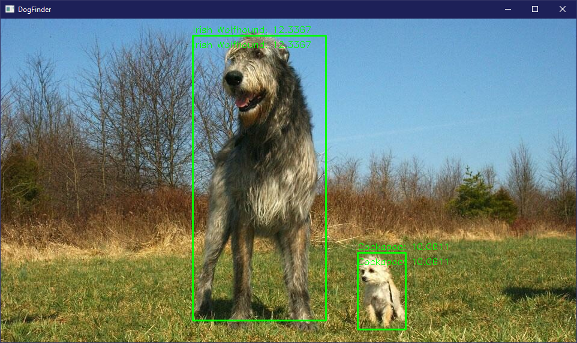
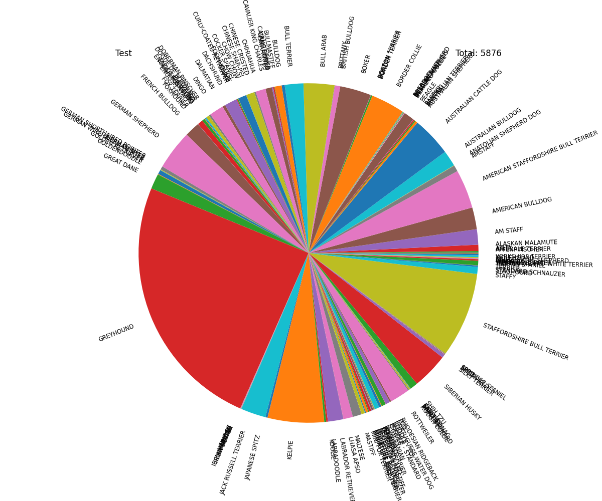

# Dog breeds recognizer

## Содержание

- [Вступление](#introduction)
- [Входные и выходные данные](#inout_data)
- [Алгоритм](#alg)
- [Подготовка данных](#dataset)
- [Результаты обучения](#learn)
- [Библиография](#biblio)

## <a id="introduction">Вступление</a>
Данная работа посвящена исследованию сверточной нейронной сети AlexNet[[1]](#bib1) для задачи распознования пород собак.
Результирующий продукт способен находить и распознавать собаку некоторой породу на изображении.
В рамках исследования была изучена результативность обучения сверточной нейронной сети на различных наборах данных.

## <a id="inout_data">Входные и выходные данные</a>
На вход готовому решению подаётся фотография в формате jpg, png или bmp. Желательно (для достижения большей точности) цветная и разрешение фрагмента содержащего собаку должно быть не менее 227*227.
Выходом программы является строка, являющаяся названием одной из пород собак.\
Пример работы приложения:\

Список пород:
- Afghan
- Airedale
- American Bullbog
- Basset
- Beagle
- Bermaise
- Bichon Frise
- Blenheim
- Bloodhound
- Bluetick
- Border Collie
- Borzoi
- Boxer
- Bull Mastiff
- Bull Terrier
- Bulldog
- Cairn
- Chihuahua
- Chinese Crested
- Chow
- Clumber
- Cockapoo
- Cocker
- Collie
- Corgi
- Dachshund
- Dalmation
- Doberman
- French Bulldog
- German Sheperd
- Golden Retriever
- Great Dane
- Greyhound
- Groenendael
- Irish Spaniel
- Irish Wolfhound
- Jack Russell Terrier
- Japanese Spaniel
- Kelpie
- Komondor
- Labrador
- Lhasa
- Malinois
- Maltese
- Pekinese
- Pit Bull
- Pomeranian
- Poodle
- Pug
- Rhodesian
- Rottweiler
- Saint Bernard
- Schnauzer
- Scotch Terrier
- Shar_Pei
- Shiba Inu
- Shih-Tzu
- Siberian Husky
- Staffordshire Bull Terrier
- Yorkie

## <a id="alg">Алгоритм</a>
1. Изображение загружается в помощью OpenCV и подается на вход сети yolo3[[2]](#bib2).
2. Вырезаются фрагменты изображения, на которых с уверенностью не менее 0.9 определяется наличие собаки.
3. Для каждого такого фрагмента запускается обученная сеть AlexNet, которая предполагает породу собаки на фрагменте.
4. Наивероятнейший ответ AlexNet для каждого фрагмента выводится на изображение с помощью OpenCV.
   
## <a id="dataset">Подготовка данных</a>
Для обучения сверточной нейронной сети было выбрано два набора данных, размешенных на платформе Kaggle: [первый](https://www.kaggle.com/datasets/gpiosenka/70-dog-breedsimage-data-set) и [второй](https://www.kaggle.com/datasets/enashed/dog-breed-photos).
Особенности первого набора:
- 9300 изображений
- 70 пород собак
- "чистые" данные
  - на каждом изображении ровно одна собака
  - собака занимает всё изображение
  - собака является типичным представителем породы
  - фотография сделана с информативного ракурса
  - все изображения одного разрешения (227*227)
- разметка данных - в наборе три директории (train, test, valid). В каждой из них расположены соответственно названные директории для каждой породы. В них уже содержатся изображения.
- равномерность данных - в тренировочном и валидационном наборах содержится ровно по 10 изображений представителей каждой породы. В тренировочном от 80 до 150 изображений для каждой породы.\

Особенности второго набора:
- 117000 изображений
- более 300 уникальных строк для пород собак
- "грязные" данные
    - не на всех изображениях одна собака
    - собака занимает только некоторую часть изображения
    - достаточно большую долю занимают гибриды, помеси и беспородные собаки
    - некоторые собаки определены ошибочно
    - некоторые позы и ракурсы не позволяют определить породу собаки
- разметка данных - все изображения лежат вместе, соответствие имени файла и породы описано в общем csv файле
- неравномерность данных - от 1 до 2200 изображений для породы
\

Несколько примеров таких "грязных" данных:
1. Эта фотография иллюструет замечание о позах - на фото сенбернар, на распознать его будет затруднительно\

2. Эта фотография иллюструет замечание о ракурсах - на фото лабрадор\

3. Эта фотография иллюструет замечание об ошибках - согласно разметке, это йоркширский терьер, но для них недопустим белый цвет\

4. Эта фотография иллюструет замечание об ошибках - согласно разметке, это такса\
\ 
В связи с вышеописанными характеристиками наборов данных, было принято решение взять за основу первый набор и дополнить его фотографиями из второго.
Для этого  второй набор был предобработан с помощью yolo3 - выбирались изображения, где с уверенностью не менее 0.9 распознавалась ровно одна собака. Её ограничивающий прямоугольник вырезался и сохранялся в файл в директории, названной в соответствии с указанным в разметке классом. Принадлежность к тренировочному или тестовому набору определялась случайным образом с вероятностями 0.6 и 0.4 соответственно. После такой предобработки осталось около 68000 изображений и 274 строки для пород собак. После удаления гибридов, помесей и беспородных осталось примерно 14500 изображений и 131 уникальная порода.
Данные после удаления помесей:
\

Далее по количеству фотографий в первом и втором наборах данных были выбраны 59 пород, 55 из которых из первого набора, 27 из которых были дополнены изображениями из второго набора и 4 породы были добавлены из второго набора. Так же в тренировочный набор были добавлены валидационные (не тестовые) данные из первого набора. Результирующая тренировочная выборка составила 13811 изображений. На построенном таким образом наборе проводились исследования. Для результирующего продукта набор данных был немного изменен - 4 породы были убраны и 5 добавлены в соответствии с личными предпочтениями. Для добавленных пород (Dachshund, Irish Wolfhound, Saint Bernard, Shiba Inu, Yorkie) были добавлены дополнительные изображения, найденные в интернете и обработанные вручную.
\

Для исследования было взято 4 набора данных с одинаковым спском пород:
- несбалансироанный - построенный описанным образом набор данных
\

- несбалансированный со сбалансированным тестом - в тестовой выборке было оставлено ровно по 10 представителей каждой породы
\

- квазисбалансированный - из пород, в которых было наиболее отличающееся число представителей были удалены часть представителей (как из тренировочного, так и из тестового)
\

- строго сбалансированный - в каждой породе было оставлено одинаковое число представителей, соответствующее минимальному: по 113 в тренировочной, по 10 в тестовой
\

## <a id="learn">Результаты обучения</a>
На графике представлены изменения точности и функции ошибки в ходе обучения на различных наборах данных:\

Из данного графика можно заметить, что независимо от набора данных, после 40 эпохи наблюдаются признаки переобучения. До 100 эпохи возможен небольшой (около 0.01) рост фактической точности, дальнейшее обучение не имеет смысла. Лучшие результаты показывают несбалансированный со сбалансированным тестом и строго сбалансированный наборы. Это объясняется сравнительной "чистотой" тестовых данных - для сбалансированного теста были оставлены данные из первого набора. При этом квазисбалансированный и несбалансированный наборы содержат заначительную долю данных из второго набора в тестовой выборке.
Так же наблюдается зависимость между общим количеством данных и результативностью обучения: в несбалансированном со сбалансированным тестом значительно больше данных, чем в строго сбалансированном и он показывет значительно более качественный результат, тоже самое верно и про несбалансироанный и квазисбалансированный наборы.
Для каждой обученной модели была построена матрица ошибок. Тестовая выборка была взята сбалансированная, одна и та же для всех трёх моделей (первая и вторая - это по сути одна и та же модель, оцененная различными способами)
- несбалансированный \

- квазисбалансированный \

- строго сбалансированный \

Можно заметить, что наиболее часто совершаемыми ошибками является спутывание визуально похожих собак - например немецкая овчарка и бельгийская малинуа.
При этом, матрица подтверждает корректность работы приложения. Для достижения большей точности имеет смысл значительно расширить наборы данных.

## <a id="biblio">Библиография</a>
1. <a id="bib1"> Krizhevsky A., Sutskever I., Hinton G. E. Imagenet classification with deep convolutional neural networks //Advances in neural information processing systems. – 2012. – Т. 25.</a>
2. <a id="bib2"> Redmon J., Farhadi A. Yolov3: An incremental improvement //arXiv preprint arXiv:1804.02767. – 2018.</a>
